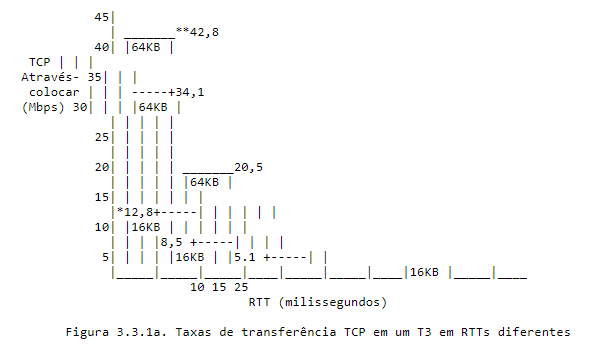
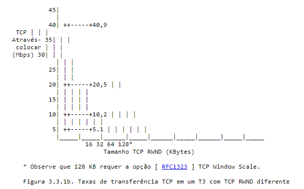

## 3 . Metodologia

O seguinte representa a ordem seqüencial das etapas para este metodologia de teste:

1. Identifique o Caminho MTU. Descoberta de MTU de caminho de camada de empacotamento (PLPMTUD) [ RFC4821 ] DEVE ser realizado. É importante identifique o caminho MTU para que o TCP TTD seja configurado corretamente para evitar a fragmentação.
2. Tempo de ida e volta da linha de base e largura de banda. Esta etapa estabelece a tempo de ida e volta (RTT) inerente e não congestionado e o gargalo Largura de banda (BB) do caminho de rede de ponta a ponta. Essas medidas são usados ​​para fornecer estimativas de TCP RWND e Send Socket Tamanhos de buffer que DEVEM ser usados ​​durante as etapas de teste subsequentes.
3. Testes de taxa de transferência de conexão TCP. Com medições de linha de base de Tempo de ida e volta e largura de banda de gargalo, único e múltiplo Os testes de taxa de transferência de conexão TCP DEVEM ser conduzidos para a linha de base desempenho da rede.

### 3.2 . Tempo de ida e volta (RTT) e largura de banda de gargalo (BB)

Antes que o teste de TCP com estado possa começar, é importante determinar o RTT de linha de base (ou seja, atraso inerente não congestionado) e BB do rede de ponta a ponta a ser testada. Essas medidas são usadas para calcular o BDP e fornecer estimativas do TCP RWND e Send Tamanhos de buffer de soquete que DEVEM ser usados ​​nas etapas de teste subsequentes.

#### 3.2.1 . Medindo RTT

Conforme definido anteriormente na Seção 1.2 , RTT é o tempo decorrido entre o clock in do primeiro bit de um segmento TCP enviado e o recebimento do último bit da confirmação TCP correspondente.

O RTT DEVE ser referenciado fora do horário de pico para obter uma figura confiável da latência de rede inerente. Por outro lado, atraso adicional causado pelo buffer de rede pode ocorrer. Também, quando amostragem de valores de RTT em um determinado intervalo de teste, o mínimo medido valor DEVE ser usado como o RTT de linha de base. Isso será mais próximo estimar o RTT inerente real. Este valor também é usado para determinar a métrica de Porcentagem de Atraso de Buffer definida na Seção 4.3 .

A lista a seguir não pretende ser exaustiva, embora resume algumas das formas mais comuns de determinar o tempo de ida e volta. A precisão de medição desejada (ou seja, ms versus nós) pode ditar se a medição RTT pode ser obtida com pings ICMP ou por um instrumento de teste de comunicações dedicado com temporizadores de precisão. o objetivo desta seção é listar várias técnicas em ordem de precisão decrescente.

- Use equipamentos de teste em cada extremidade da rede, "fazendo um loop" testador final para que um fluxo de pacotes possa ser medido para frente e para trás de ponta a ponta. Esta medição RTT pode ser compatível com atraso protocolos de medição especificados em [ RFC5357 ].

- Realizar capturas de pacotes de sessões de teste TCP usando "iperf" ou FTP, ou outros aplicativos de teste TCP. Ao executar vários experimentos, as capturas de pacotes podem então ser analisadas para estimar o RTT. Isso é importante notar que os resultados baseados em SYN -> SYN-ACK no início de sessões TCP DEVE ser evitado, pois os Firewalls podem abrandar os apertos de mão de 3 vias. Além disso, do lado do remetente, O utilitário LINUX TCPTRACE de Ostermann com argumentos -l -r pode ser usado para extrair os resultados do RTT diretamente das capturas de pacotes.

- Obter estatísticas RTT disponíveis a partir de MIBs definidas em [ RFC4898 ].

- Os pings ICMP também podem ser adequados para fornecer tempo de ida e volta estimativas, desde que o tamanho do pacote seja levado em consideração estimativas (ou seja, pings com tamanhos de pacotes diferentes podem ser requeridos). Algumas limitações com ping ICMP podem incluir ms resolução e se os elementos da rede estão ou não respondendo aos pings. Além disso, o ICMP é frequentemente limitado ou segregado em diferentes filas de buffer. O ICMP pode não funcionar se o QoS (Quality of Service) a reclassificação é feita em qualquer salto. ICMP não é tão confiáveis ​​e precisos como medições em banda.

#### 3.2.2 . Medição BB

Antes que qualquer teste de taxa de transferência TCP possa ser realizado, a largura de banda testes de medição DEVEM ser executados com fluxos IP sem estado (ou seja, não Stateful TCP) para determinar o BB do NUT. Esses medições DEVEM ser realizadas em ambas as direções, especialmente em redes de acesso assimétricas (por exemplo, DSL de taxa de bits assimétrica (ADSL) Acesso). Estes testes DEVEM ser realizados em vários intervalos ao longo de um dia útil ou mesmo durante uma semana.

Testes em vários intervalos de tempo forneceriam uma melhor caracterização do TCP Throughput e melhor percepção de diagnóstico (por casos em que há problemas de desempenho TCP). Os testes de largura de banda DEVE produzir saídas registradas das larguras de banda alcançadas em todo o duração completa do teste.

Existem muitas técnicas bem estabelecidas disponíveis para fornecer medidas estimadas de largura de banda em uma rede. É um comum prática para provedores de rede conduzirem largura de banda de camada 2/3 testes de capacidade usando [ RFC2544 ], embora se entenda que [ RFC2544 ] nunca foi feito para ser usado fora de um ambiente de laboratório. Essas medições de largura de banda DEVEM usar técnicas de capacidade de rede conforme definido em [ RFC5136 ].

### 3.3 . Medindo a taxa de transferência TCP

Esta metodologia define especificamente a medição TCP Throughput técnicas para verificar o desempenho TCP máximo alcançável em um rede IP de classe empresarial.

Com medições de linha de base de RTT e BB da Seção 3.2 , uma série de testes de taxa de transferência de conexão TCP única e/ou múltipla DEVEM ser conduzido.

O número de tentativas e a escolha entre TCP único ou múltiplo conexões serão baseadas na intenção do teste. Um único-teste de conexão TCP pode ser suficiente para medir o alcance rendimento da conectividade Metro Ethernet. No entanto, é importante observar que várias técnicas de gerenciamento de tráfego podem ser usadas em um rede IP e que algumas dessas técnicas só podem ser testadas com várias conexões. Como exemplo, várias sessões TCP podem ser necessários para detectar modelagem de tráfego versus policiamento. Múltiplo sessões também podem ser necessárias para medir o Active Queue Management atuação. No entanto, o teste de gerenciamento de tráfego não está dentro do escopo desta metodologia de teste.

Em todas as circunstâncias, é RECOMENDADO executar os testes em cada direção independentemente primeiro e depois executá-los em ambas as direções simultaneamente. Também é RECOMENDADO executar os testes em diferentes horas do dia.

Em cada caso, o TCP Transfer Time Ratio, o TCP Efficiency Porcentagem, e a Porcentagem de Atraso do Buffer DEVE ser medida em cada direção. Essas 3 métricas são definidas na Seção 4.

#### 3.3.1 . TCP RWND mínimo

O TCP TTD DEVE permitir o Send Socket Buffer e Receive Window tamanhos a serem definidos superiores ao BDP; caso contrário, o desempenho do TCP ser limitado. No ambiente do cliente empresarial, essas configurações são geralmente não ajustável pelo usuário médio. Essas configurações são codificado no aplicativo ou configurado no sistema operacional como parte de uma imagem corporativa. Em muitos casos, o host do usuário Send As configurações de tamanho de Socket Buffer e Receive Window não são ideais.

Esta seção fornece derivações de BDPs em várias redes condições. Ele também fornece exemplos de taxa de transferência TCP alcançável com vários tamanhos de TCP RWND. Isso fornece orientações importantes mostrando o que pode ser alcançado com configurações superiores ao BDP, versus o que seria alcançado em uma variedade de condições do mundo real.

O tamanho mínimo requerido de TCP RWND pode ser calculado a partir do Produto de atraso de largura de banda (BDP), que é o seguinte:

      BDP (bits) = RTT (seg) X BB (bps)

Observe que o RTT está sendo usado como a variável "Delay" para o BDP. Então, dividindo o BDP por 8, obtemos o TCP mínimo necessário Tamanho RWND em Bytes. Para melhores resultados, o Send Socket Buffer DEVE ser ajustado para o mesmo valor em cada extremidade da rede.

      TCP RWND mínimo necessário = BDP / 8

Como exemplo, em um link T3 com RTT de 25 ms, o BDP seria igual ~1.105.000 bits, e o TCP RWND mínimo necessário seria ~138 KB.

Observe que cálculos separados são NECESSÁRIOS em caminhos assimétricos. Um exemplo de caminho assimétrico seria uma linha ADSL RTT de 90 ms com 5 Mbps downstream e 640 Kbps upstream. O BDP a jusante seria igual ~450.000 bits, enquanto o upstream seria apenas ~57.600 bits.

A tabela a seguir fornece algumas velocidades de link de rede representativas, RTT, BDP e seus tamanhos mínimos de TCP RWND necessários associados.

       Link mínimo obrigatório
       Velocidade* RTT BDP TCP RWND
       (Mbps) (ms) (bits) (KBytes)

---

        1,536 20,00 30,720 3,84
        1,536 50,00 76,800 9,60
        1,536 100,00 153,600 19,20
       44,210 10,00 442,100 55,26
       44,210 15,00 663,150 82,89
       44,210 25,00 1.105.250 138,16
      100.000 1,00 100.000 12,50
      100.000 2,00 200.000 25,00
      100.000 5,00 500.000 62,50
    1.000.000 0,10 100.000 12,50
    1.000.000 0,50 500.000 62,50
    1.000.000 1,00 1.000.000 125,00

10.000.000 0,05 500.000 62,50
10.000.000 0,30 3.000.000 375,00

- Observe que a velocidade do link é o BB para o NUT

  Tabela 3.3.1. Velocidade do link, RTT, BDP calculado e TCP RWND mínimo

Na tabela acima, as seguintes velocidades de link serial são usadas:

      - T1 = 1,536 Mbps (para um recurso de codificação de linha B8ZS)
      - T3 = 44,21 Mbps (para um recurso de enquadramento C-Bit)

A tabela anterior ilustra o TCP RWND mínimo necessário. Se um menor tamanho TCP RWND é usado, então o TCP Throughput não pode ser ótimo. Para calcular a taxa de transferência TCP, a seguinte fórmula é usado:

      Taxa de transferência TCP = TCP RWND X 8 / RTT

Um exemplo poderia ser um caminho IP de 100 Mbps com RTT de 5 ms e um RWND TCP de 16 KB; então:

      Taxa de transferência TCP = 16 KBytes X 8 bits / 5 ms
      Taxa de transferência TCP = 128.000 bits / 0,005 seg
      Taxa de transferência TCP = 25,6 Mbps

Outro exemplo, para um T3 usando a mesma fórmula de cálculo, é ilustrado na Figura 3.3.1a:

      Taxa de transferência TCP = 16 KBytes X 8 bits / 10 ms
      Taxa de transferência TCP = 128.000 bits / 0,01 seg
      Taxa de transferência TCP = 12,8 Mbps*

Quando o tamanho do TCP RWND excede o BDP (link T3 e TCP RWND de 64 KB em um caminho RTT de 10 ms), o limite máximo de quadros por segundo (FPS) de 3664 é alcançado, e então a fórmula é:

      Taxa de transferência TCP = FPS máximo X (MTU - 40) X 8
      Taxa de transferência TCP = 3664 FPS X 1460 Bytes X 8 bits
      Taxa de transferência TCP = 42,8 Mbps**

O diagrama a seguir compara as taxas de transferência TCP alcançáveis ​​em um T3 com Send Socket Buffer e TCP RWND tamanhos de 16 KB versus 64 KB.

O diagrama a seguir mostra a taxa de transferência TCP alcançável em 25 ms T3 quando os tamanhos de buffer de soquete de envio e RWND TCP são aumentados.

